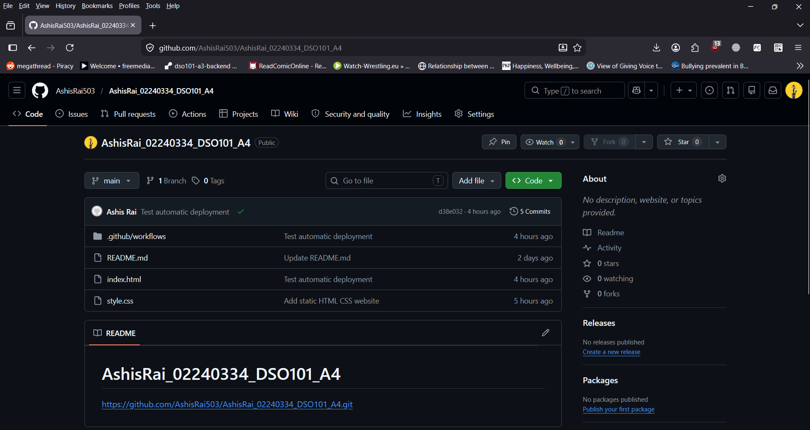
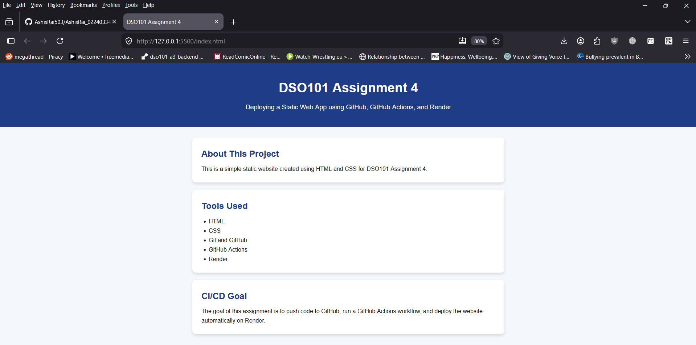
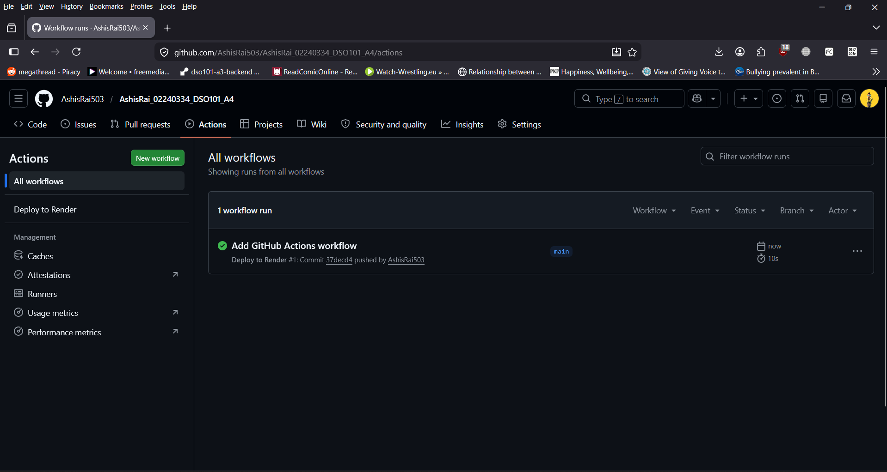
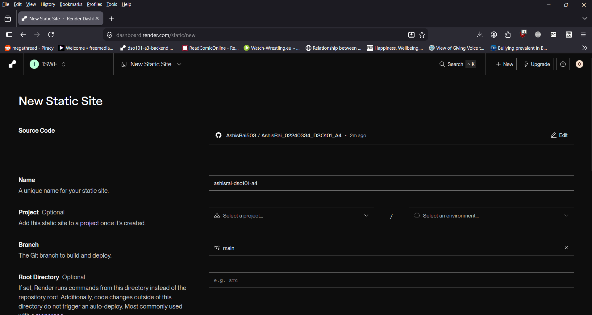
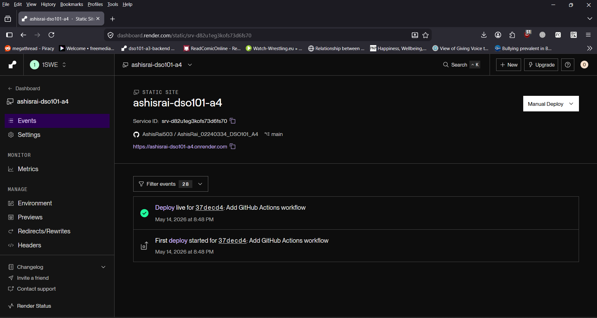
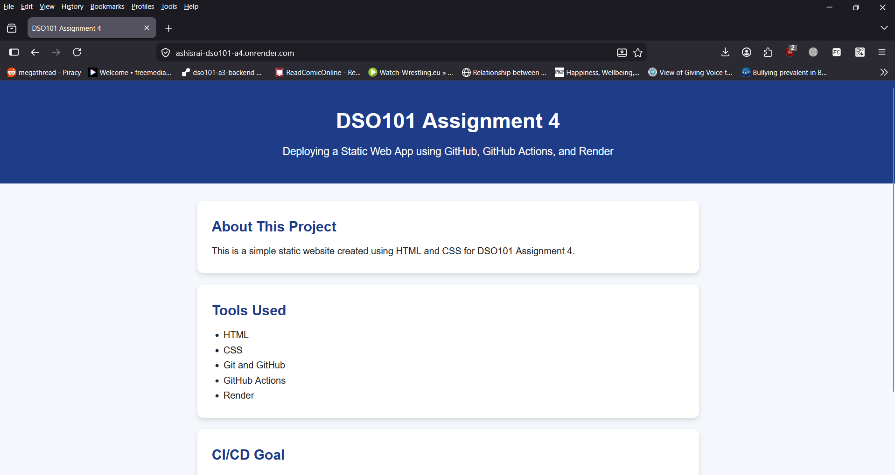
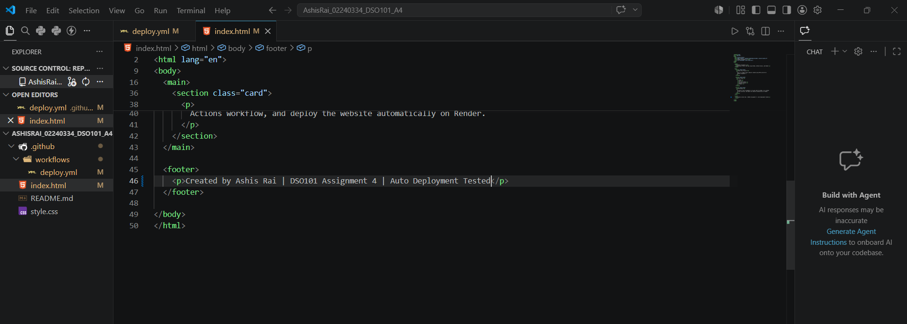
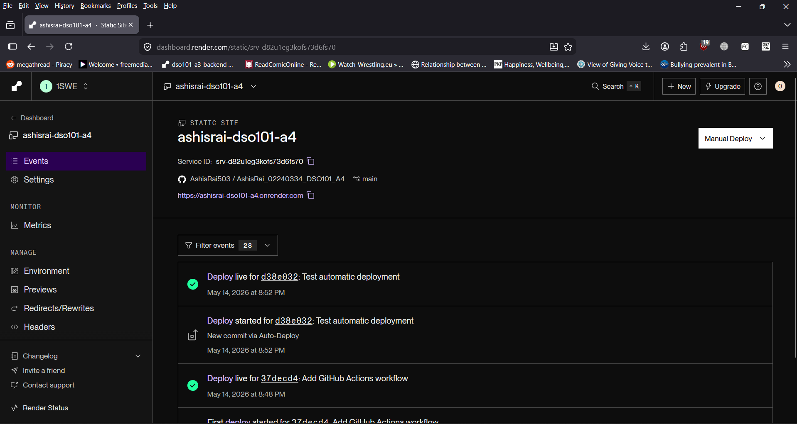
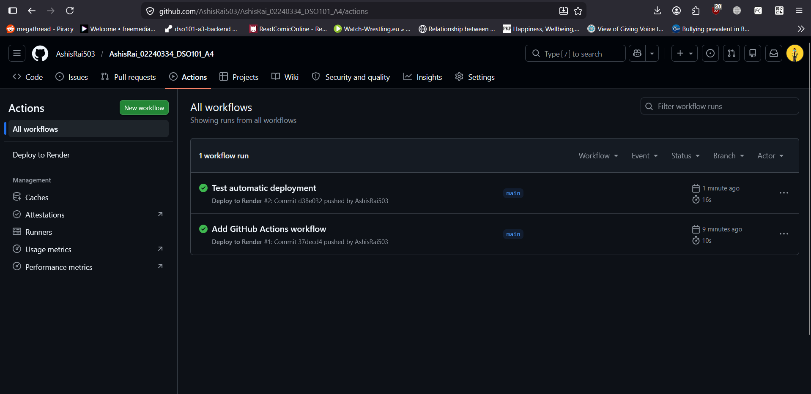
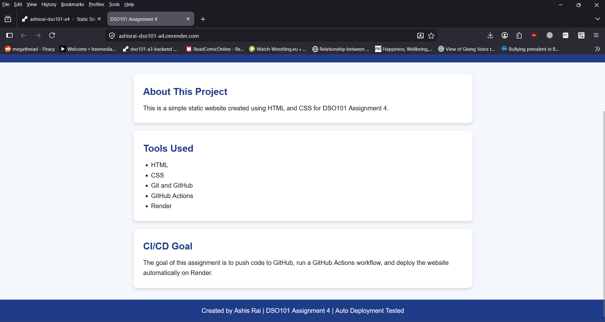

# DSO101 Assignment 4 - Static Web App Deployment

## Student Information

**Name:** Ashis Rai  
**Student ID:** 02240334  
**Module:** DSO101 - Continuous Integration and Continuous Deployment  
**Assignment:** Assignment 4  

## Project Title

Deploy Your First Web App using GitHub and Render

## Project Description

This project is a simple static web application created using HTML and CSS. The purpose of this assignment is to learn the basic workflow of Git, GitHub, GitHub Actions, and deployment using Render.

The website was created as Option A: Static Website using HTML and CSS.

## Tools Used

- HTML
- CSS
- Git
- GitHub
- GitHub Actions
- Render

## Project Structure

```text
AshisRai_02240334_DSO101_A4/
│
├── index.html
├── style.css
├── README.md
└── .github/
    └── workflows/
        └── deploy.yml
```

## GitHub Actions Workflow

A GitHub Actions workflow was created in the following path:

```text
.github/workflows/deploy.yml
```

The workflow runs automatically whenever code is pushed to the `main` branch.

The workflow includes:

1. Checking out the repository code.
2. Running a dummy step to confirm that the code was pushed successfully.

## Deployment on Render

The project was deployed on Render as a Static Site.

### Render Settings Used

| Setting | Value |
|---|---|
| Service Type | Static Site |
| Branch | main |
| Build Command | Empty |
| Publish Directory | . |

Since this is a simple HTML and CSS project, no build command was required. The publish directory was set to `.` because the `index.html` file is located in the root folder of the project.

## Live Website

Live deployed URL:

```text
https://ashisrai-dso101-a4.onrender.com
```

## GitHub Repository

GitHub repository link:

```text
https://github.com/AshisRai503/AshisRai_02240334_DSO101_A4
```

## CI/CD Testing

To test automatic deployment, a small change was made to the website footer and pushed to GitHub.

After pushing the change:

1. GitHub Actions workflow ran successfully.
2. Render automatically deployed the updated version.
3. The live website showed the updated footer text.

## Screenshots Taken

The following screenshots were taken as proof of completion:

1. GitHub repository creation.


2. Local website running in the browser.


3. GitHub Actions workflow running successfully.

4. Render Static Site deployment settings.


5. Render deployment success.

6. Live website opened using the Render URL.


7. Auto-deployment test using a new Git push.





## Conclusion

This assignment helped me understand the basic CI/CD workflow. I created a simple static web app using HTML and CSS, pushed the code to GitHub, configured GitHub Actions, and deployed the project on Render. I also tested automatic deployment by pushing a new change and verifying that the live website updated successfully.
